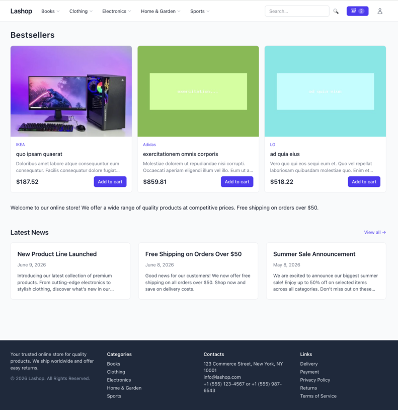
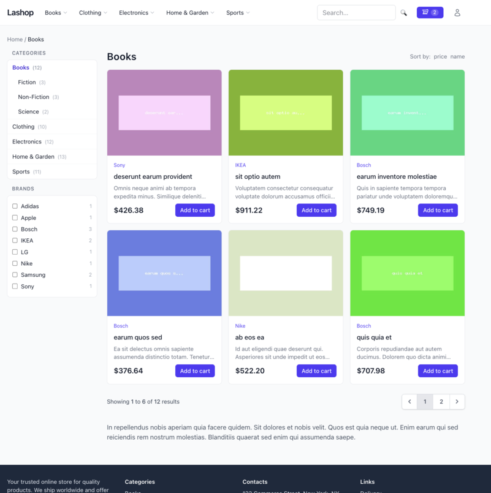
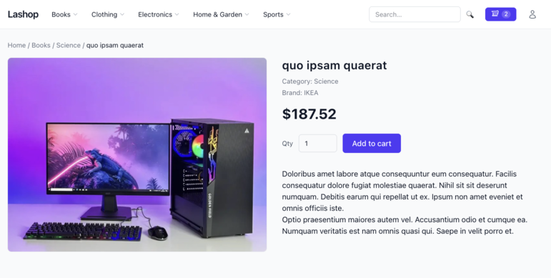
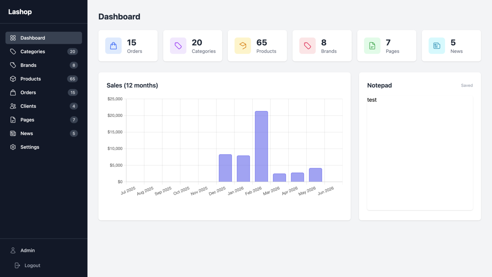
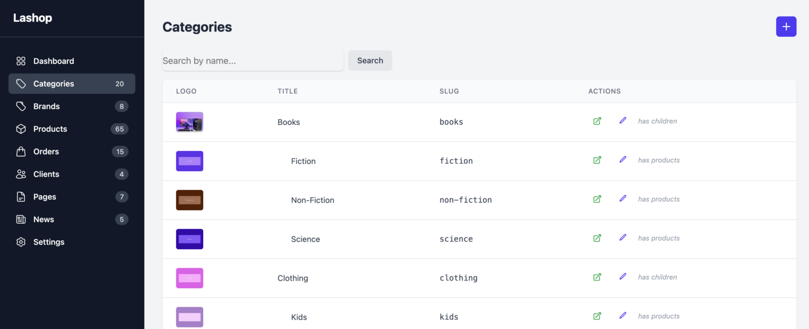
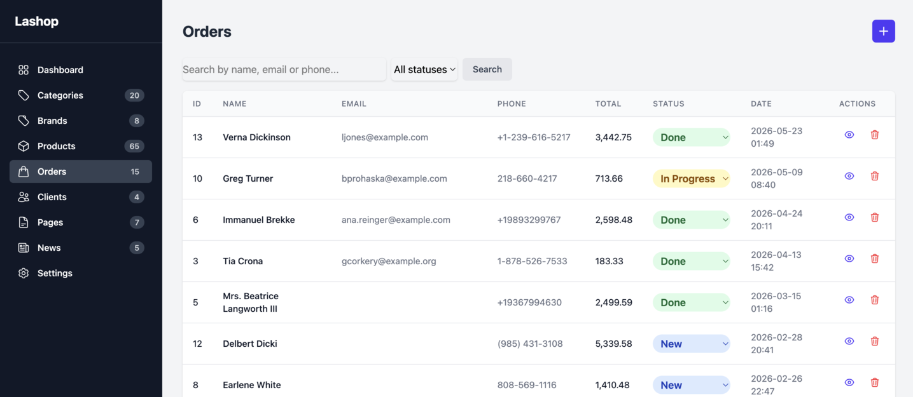

# Lashop

[](https://github.com/igoves/lashop/actions/workflows/ci.yml)
[](https://github.com/igoves/lashop)
[](https://github.com/igoves/lashop/issues)
[](https://github.com/igoves/lashop)
[](https://github.com/igoves/lashop/stargazers)
[](https://github.com/igoves/lashop/network)

## Screenshots








## About Lashop

Simple shop built on Laravel 13. Works without MySQL — SQLite only.

## Features

- **SQLite-only** — no MySQL/PostgreSQL required
- **Fullajax navigation** — page transitions without full reloads
- **SEO-friendly** — meta tags, OpenGraph, XML sitemap, clean URLs
- **Admin panel** — products, categories, brands, pages, orders, news, settings
- **E-commerce essentials** — cart, checkout, order emails, stock tracking
- **Tailwind CSS** — utility-first styling out of the box
- **Minimal dependencies** — almost zero third-party packages
- **Docker-ready** — Laravel Sail for one-command setup
- **PWA support** — Service Worker for offline capabilities
- **Sorting & Filters** — product search with brand/category filters, order search by name/email/phone
- **Authorization** — admin authentication with role-based access control
- **News system** — blog-like news articles with admin CRUD and frontend display
- **Order management** — status tracking, delivery/payment methods, item editing
- **Dashboard** — sales chart, auto-save notepad, entity counters

## Project Structure

```
lashop/
├── app/
│   ├── Console/                  # Artisan commands (legacy:migrate)
│   ├── Http/
│   │   ├── Controllers/
│   │   │   ├── Admin/            # Admin panel controllers
│   │   │   │   ├── AdminController.php       # Base admin controller (auth check)
│   │   │   │   ├── BrandController.php
│   │   │   │   ├── CategoryController.php
│   │   │   │   ├── DashboardController.php
│   │   │   │   ├── NewsController.php
│   │   │   │   ├── OrderController.php
│   │   │   │   ├── PageController.php
│   │   │   │   ├── ProductController.php
│   │   │   │   └── SettingController.php
│   │   │   ├── Auth/
│   │   │   │   └── LoginController.php
│   │   │   └── Frontend/
│   │   │       ├── HomeController.php
│   │   │       ├── NewsController.php
│   │   │       ├── PageController.php
│   │   │       ├── SearchController.php
│   │   │       ├── SitemapController.php
│   │   │       └── Shop/          # E-commerce controllers
│   │   │           ├── CartController.php
│   │   │           ├── CategoryController.php
│   │   │           ├── OrderController.php
│   │   │           └── ProductController.php
│   │   ├── Middleware/
│   │   └── Requests/
│   ├── Mail/                      # Order confirmation emails
│   ├── Models/
│   │   ├── Page.php
│   │   ├── Setting.php
│   │   ├── User.php
│   │   └── Shop/
│   │       ├── Category.php       # Nested set with tree caching
│   │       ├── Order.php
│   │       ├── OrderItem.php
│   │       └── Product.php
│   ├── Providers/
│   ├── Services/
│   │   ├── CartService.php        # Cart logic (add/remove/totals)
│   │   ├── ImageService.php       # Image resize for brands/categories
│   │   └── ProductImageService.php # Image resize via Intervention
│   ├── View/Components/           # Blade components
│   └── helpers.php                # Global helper functions
├── config/
│   └── shop.php                   # Image sizes, upload path
├── database/
│   ├── factories/                 # Model factories for tests
│   ├── migrations/
│   └── seeders/
├── resources/
│   ├── css/
│   ├── js/
│   └── views/
│       ├── admin/                 # Admin panel views
│       ├── auth/
│       ├── components/            # Shared Blade components
│       └── frontend/              # Public storefront views
├── routes/
│   └── web.php                    # All routes
└── tests/
    ├── Feature/
    │   ├── Admin/                 # Admin panel tests
    │   ├── Frontend/              # Public page tests
    │   ├── Models/                # Model unit tests
    │   └── Services/
    └── Unit/
```

## Requirements

- PHP 8.3+
- Composer
- Node 20+ / npm
- SQLite (built into PHP)

**Or Docker** — via Laravel Sail (recommended, nothing to install on host).

## Installation

### Docker / Sail (recommended)

```bash
git clone https://github.com/igoves/lashop.git && cd lashop
cp .env.example .env

# Install dependencies via a temporary Composer container
docker run --rm -v "$(pwd):/var/www/html" -w /var/www/html \
    laravelsail/php84-composer:latest composer install

./vendor/bin/sail up -d
./vendor/bin/sail artisan key:generate
./vendor/bin/sail artisan migrate
./vendor/bin/sail artisan db:seed          # creates admin@example.com / secret
./vendor/bin/sail npm install
```

### Local PHP

```bash
git clone https://github.com/igoves/lashop.git && cd lashop
cp .env.example .env
composer install
php artisan key:generate
php artisan migrate
php artisan db:seed                        # creates admin@example.com / secret
npm install
```

## Running locally

### Docker / Sail

```bash
./vendor/bin/sail up -d      # start
./vendor/bin/sail npm run dev   # asset watcher (keep running while developing)

./vendor/bin/sail down       # stop
```

App: http://localhost · Admin: http://localhost/admin

### Local PHP

```bash
php artisan serve            # start the app (terminal 1)
npm run dev                  # asset watcher (terminal 2)
```

App: http://localhost:8000 · Admin: http://localhost:8000/admin

Stop either process with `Ctrl+C`. For a one-off production-style build instead of the watcher, run `npm run build` — then only `php artisan serve` is needed.

## Test Users

After seeding (`php artisan db:seed`), the following accounts are available:

| Role | Email | Password | Panel |
|------|-------|----------|-------|
| Admin | `admin@example.com` | `secret` | `/admin` |
| Customer | `customer@example.com` | `secret` | `/` |

## Tests

```bash
php artisan test             # or: ./vendor/bin/pest
# single file / filter:
./vendor/bin/pest tests/Feature/Frontend/CartTest.php
./vendor/bin/pest --filter="stale slug"
# via Sail:
./vendor/bin/sail artisan test
```

All tests use SQLite `:memory:` — no database setup or asset build required.

## Code Style

```bash
./vendor/bin/pint          # fix
./vendor/bin/pint --test   # check only (used in CI)
```

## Routing

All routes are defined in `routes/web.php`.

### Public Routes

| Method | URI | Name | Description |
|--------|-----|------|-------------|
| GET | `/` | `home` | Homepage |
| GET | `/sitemap.xml` | `sitemap` | XML sitemap |
| GET/POST | `/cart` | `cart.*` | View / add to cart |
| DELETE | `/cart/{id}` | `cart.destroy` | Remove item from cart |
| GET/POST | `/search/{story}` | `search.*` | Search form / results |
| POST | `/orders` | `orders.store` | Place an order (throttled: 5/min) |
| GET | `/order/success` | `orders.success` | Order confirmation page |
| GET | `/news` | `news.index` | News listing |
| GET | `/news/{slug}` | `news.show` | Single news article |
| GET | `/{id}-{slug}` | `products.show` | Product page (`/42-my-product`) |
| GET | `/{slug}.html` | `pages.index` | Static page (`/about.html`) |
| GET | `/{path}` | `categories.show` | Category by nested path (`/electronics/phones`) |

### Admin Routes (prefix `/admin`, requires auth + admin)

| Method | URI | Name | Description |
|--------|-----|------|-------------|
| GET | `/admin` | `admin.dashboard` | Dashboard with sales chart |
| POST | `/admin/dashboard/notepad` | `admin.dashboard.saveNotepad` | Auto-save notepad |
| GET/PUT | `/admin/settings` | `admin.settings.*` | Site settings |
| Resource | `/admin/pages` | `admin.pages.*` | CRUD pages (except show) |
| Resource | `/admin/categories` | `admin.categories.*` | CRUD categories (except show) |
| Resource | `/admin/brands` | `admin.brands.*` | CRUD brands (except show) |
| Resource | `/admin/products` | `admin.products.*` | CRUD products (except show) |
| Resource | `/admin/orders` | `admin.orders.*` | List / view / edit orders |
| PATCH | `/admin/orders/{order}/status` | `admin.orders.updateStatus` | Quick status change |
| Resource | `/admin/news` | `admin.news.*` | CRUD news articles (except show) |

### Route Order

Routes are declared in dependency order — catch-all category route is last so it doesn't swallow specific routes.

## Extending the Project

### Adding a New Model

1. Create migration: `php artisan make:migration create_foos_table`
2. Create model: `php artisan make:model Shop/Foo`
3. Create factory: `php artisan make:factory FooFactory`
4. Create controller: `php artisan make:controller Admin/FooController --resource`
5. Add routes in `routes/web.php` under the admin group
6. Add views in `resources/views/admin/`
7. Write tests in `tests/Feature/Admin/`

### Adding a New Admin Section

1. Create controller extending `AdminController` (handles auth check)
2. Register resource route in `routes/web.php` inside the `admin` middleware group
3. Create views in `resources/views/admin/`
4. Add sidebar link in `resources/views/admin/` layout
5. Write feature tests

### Adding a New Frontend Page

1. Create controller in `app/Http/Controllers/Frontend/`
2. Add route in `routes/web.php`
3. Create view in `resources/views/frontend/`
4. For fullajax support, return a partial when request is AJAX

### Cart

Cart is session-based. Use `CartService` for all operations:

```php
app(CartService::class)->add($productId, $qty);
app(CartService::class)->remove($productId);
app(CartService::class)->items(); // with loaded products and totals
```

### Tests

All tests use SQLite in-memory database. Add tests in `tests/Feature/`:

```bash
php artisan test                              # all tests
./vendor/bin/pest tests/Feature/Admin/         # admin only
./vendor/bin/pest --filter="cart"              # by keyword
```

## Legacy Data Migration

To import data from the pre-rewrite SQLite dump (`docs/reference/database.sqlite`):

```bash
php artisan legacy:migrate --fresh
```

Normalizations applied:
- `parent_id = 0` → `NULL` (FK-safe)
- Numeric product slugs → `slug(title)`
- HTML pages: embedded base64 images removed, inline event handlers stripped
- Old orders: raw `order` column stored as `legacy_order` archive text (not parsed)

## Backlog
- lightbox
- cost filter
- sales
- compare
- reviews
- favorites
- popup cart

## License

Lashop is open-sourced software licensed under the [MIT license](http://opensource.org/licenses/MIT).
